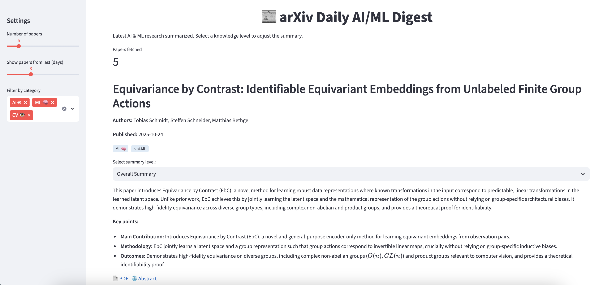

# 📰 arXiv Daily AI/ML Digest

Welcome to your **daily dose of AI & ML research**, served fresh from arXiv! 🤓☕  
This Streamlit app fetches the latest papers, gives you **bite-sized summaries**, and highlights the **key points** — perfect for staying up-to-date without drowning in PDFs. 📄✨

---

## 🧩 Features

- **Fetch the freshest papers** in AI & ML from arXiv:
  - Categories: Artificial Intelligence 🤖, Machine Learning 🧠, and Computer Vision 👁️
  - Filter by **recent days**, number of papers, and categories.

- **Multi-level summaries** via Google Gemini API:
  - **Overall Summary** (concise 2–3 sentences)
  - **High School** (super simple, jargon-free!)
  - **Bachelors** (clear technical explanation)
  - **Masters** (concise, technical)
  - **Expert** (precise, for researchers)

- **Key Points** always visible 📝
- Direct **PDF** and **abstract** links 🌐

- **Cached results** for fast, smooth scrolling 🚀

---

## ⚡ Quick Start

### 1️⃣ Clone the repo
```bash
git clone https://github.com/lekersten/arxiv-digest.git
cd arxiv-digest
```

### 2️⃣ Install Dependencies

Make sure you have **Python 3.10+** installed.

Then, install the required packages:

```bash
pip install streamlit requests google-genai
```

### 3️⃣ Set Your Gemini API Key 🔑

The app uses the Gemini API to generate summaries.
Set your API key in your environment before running the app.

**macOS / Linux:**
```
export GEMINI_API_KEY="your_api_key_here"
```

**Windows (PowerShell):**
```
setx GEMINI_API_KEY "your_api_key_here"
```

💡 Tip: Keep your key secret! Never push it to GitHub.

### 4️⃣ Run the app ###
```
streamlit run arxiv_daily_digest.py
```

Your browser will open with the arXiv Daily Digest! 🎉

---
## 🖌️ How to Use ##

**1. Homepage:**

See the newest papers with a 2–3 sentence synopsis.

Key points are right below — quick highlights of methods & findings.

Links to PDF 📄 and abstract 🌐 for each paper.

**2. Knowledge Level Selector:**

- Change the summary to match your background:

    - High School 👩‍🎓

    - Bachelors 🎓

    - Masters 🧑‍🎓

    - Expert 🧑‍🔬

Overall Summary is always the default.

**3. Sidebar Filters:**

- Number of papers

- Days back

- Categories of interest

---
## 🖼️ Screenshot ##
<p align="center">
    
</p>
